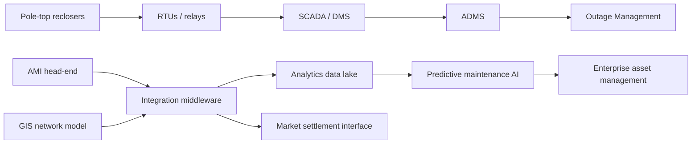

# Complete Visual Evidence Fixture - Eastland-Style DNSP

> SYNTHETIC COMPOSITE - TEST FIXTURE ONLY.

## Evidence Summary

The discovery pack identifies real architecture structure: OT field devices, SCADA/ADMS, integration middleware, corporate systems, market interfaces, analytics, and downstream maintenance workflows. It includes known systems, relationships, flow direction, data classifications, and downstream use.

## System / Integration Landscape

## Data Register

| Data Domain | Source System | Frequency | Downstream Systems | Classification / Note |
|-------------|---------------|-----------|--------------------|-----------------------|
| SCADA telemetry | RTU to SCADA/ADMS | Real time | Historian, ADMS, DERMS | OT-critical |
| Smart meter data | AMI head-end | 5-30 minute interval | Billing, settlement, data lake | Customer information |
| Network model | GIS | Daily/weekly | ADMS, EAM, DERMS | Master data |
| Maintenance events | Predictive AI | Event-driven | Work-order system, field mobility | Operational asset data |

## Expected Visual Decision

The evidence contains enough structure to identify real nodes and relationships. Companion `/arckit:diagram`, `/arckit:dfd`, and `/arckit:data-model` artefacts are appropriate.
